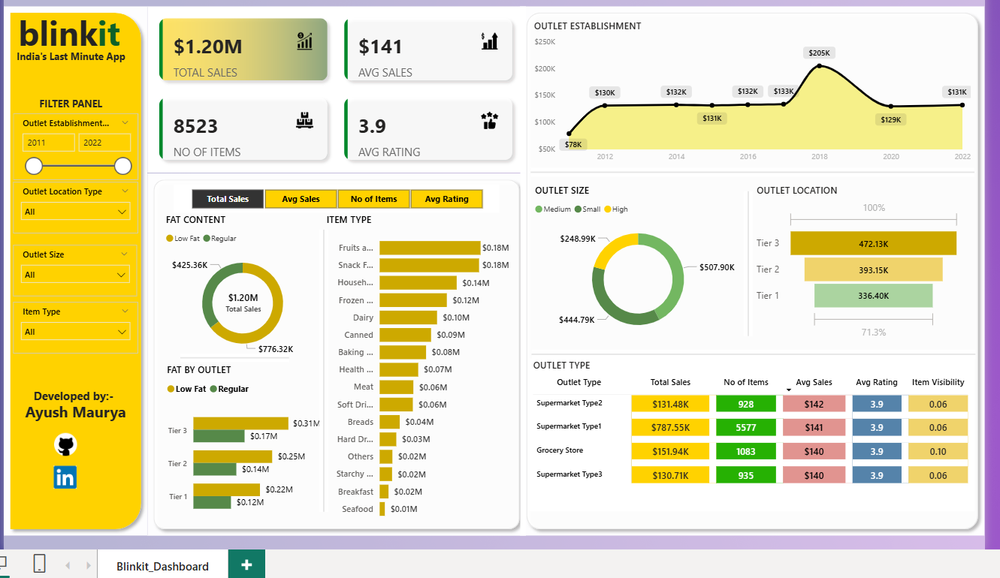

# 🛒 Blinkit Data Analytics & Store Insights  

A comprehensive **end-to-end data analytics project** analyzing Blinkit’s retail operations using  
**MySQL, Power BI, and Python (Jupyter Notebook)**.

This repository delivers:
- **Structured SQL-based data cleaning, modeling, and analytics**
- **Interactive Power BI dashboards for business users**
- **In-depth Python-based exploratory data analysis (EDA)**

---

## 📌 Project Overview  

This project analyzes **Blinkit outlet, product, and sales performance** using three complementary approaches:

1. **MySQL Analysis**
   - Data cleaning and transformation  
   - Star schema data modeling  
   - KPI generation and analytical SQL queries  

2. **Power BI Dashboard**
   - Interactive dashboards for executives and managers  
   - KPI tracking and visual insights  

3. **Jupyter Notebook (Python)**
   - Data preprocessing  
   - Exploratory data analysis (EDA)  
   - Trend, category, and outlet-level insights  

---

## 🛠️ Tech Stack  

- 🛢️ **MySQL Workbench** – Data cleaning, modeling, ETL, and SQL analytics  
- 📊 **Power BI Desktop** – Interactive dashboards and reporting  
- 🧠 **DAX** – Measures, KPIs, and calculated fields  
- 📝 **Jupyter Notebook (Python)** – Data analysis and EDA  
- 📦 **Python Libraries** – Pandas, NumPy, Matplotlib, Seaborn  
- 📁 **File Formats** – `.sql`, `.pbix`, `.ipynb`, `.csv`, `.png`  

---

## 📊 Data Source  

**Dataset:** Blinkit retail sales dataset  

**Includes:**
- Item details (category, fat content, weight)  
- Outlet details (type, size, city tier, establishment year)  
- Sales metrics and customer ratings  
- SKU-level and outlet-level performance data  

---

## 🌟 Business Problem  

Blinkit operates across multiple outlet types and locations, but lacks a **unified analytics system** to clearly understand:

- High-performing outlets  
- Top-selling products and categories  
- Regional (city-tier) performance  
- Revenue contribution at SKU and outlet levels  

---

## 🎯 Project Goals  

- Build a **clean and scalable SQL data model**  
- Generate **standardized KPIs** for business reporting  
- Create an **interactive Power BI dashboard**  
- Perform **deep exploratory analysis using Python**  
- Deliver actionable insights for operational and strategic decisions  

---

## 🛢️ SQL Workflow (MySQL)  

### ✔ 1. Data Cleaning  
- Renamed columns to `snake_case`  
- Fixed encoding and formatting issues  
- Converted numeric and date fields  
- Removed duplicates using `ANY_VALUE()`  
- Standardized schema for analytics  

### ✔ 2. Data Modeling (Star Schema)  

- **item_dim**  
- **outlet_dim**  
- **sales_fact**  
- **sales_summary**
- 
📄 SQL file: **Blinkit Data Analysis sql.sql**

---

## 🔍 SQL Analytics Performed  

- Total sales and average rating  
- Top 10 outlets by sales  
- Top 10 items by revenue  
- Sales by outlet type  
- Sales by city tier  
- Supermarket Type 1 performance  
- Tier-3 outlet analysis  
- KPIs stored in summary tables  

---

## 📊 Power BI Dashboard Overview  

### 🔹 Key KPIs  
- Total Sales  
- Average Sales per Outlet  
- Number of Outlets  
- Number of Product Categories  
- Year-over-Year Growth (%)  

### 🔹 Visual Analysis  
- **Sales by Outlet Type** (Bar Chart)  
- **Top Product Categories** (Treemap / Bar Chart)  
- **Sales Trend Over Time** (Line Chart)  
- **Outlet Size vs Sales** (Scatter Plot)  
- **Category Contribution (%)** (Donut Chart)  

📁 File: `Blinkit_Dashboard.pbix`  

---

## 🧪 Jupyter Notebook (Python) Analysis  

### ✔ Data Preprocessing  
- Handling missing values  
- Data type corrections  
- Encoding categorical variables  

### ✔ Exploratory Data Analysis (EDA)  
- Sales distribution analysis  
- Category-wise and outlet-wise comparisons  
- Correlation analysis  
- Trend and seasonality detection  

### ✔ Advanced Insights  
- Category vs outlet performance  
- Outlet size impact on revenue  
- Statistical observations and patterns  

📁 File: `Blinkit_Analysis.ipynb`

---

## 📈 Key Insights  

- **Supermarket Type 1** generates the highest revenue  
- **Tier-3 outlets** show strong performance despite lower infrastructure  
- A small group of SKUs contributes a large share of total revenue  
- Outlet size has a measurable impact on sales performance  
- Overall revenue is close to **₹10 lakh**, spread across **8 outlets**  

---
## 🖼️ Screenshots / Demos  

### Dashboard Preview (Power BI)  
  

## 📬 Contact
📧 Email: [mauryaayush7377@gmail.com](mailto:mauryaayush7377@gmail.com)  
🔗 [LinkedIn](https://www.linkedin.com/in/ayush4628)

